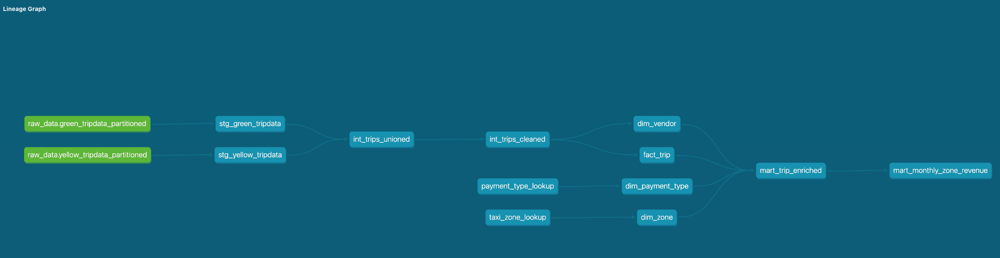
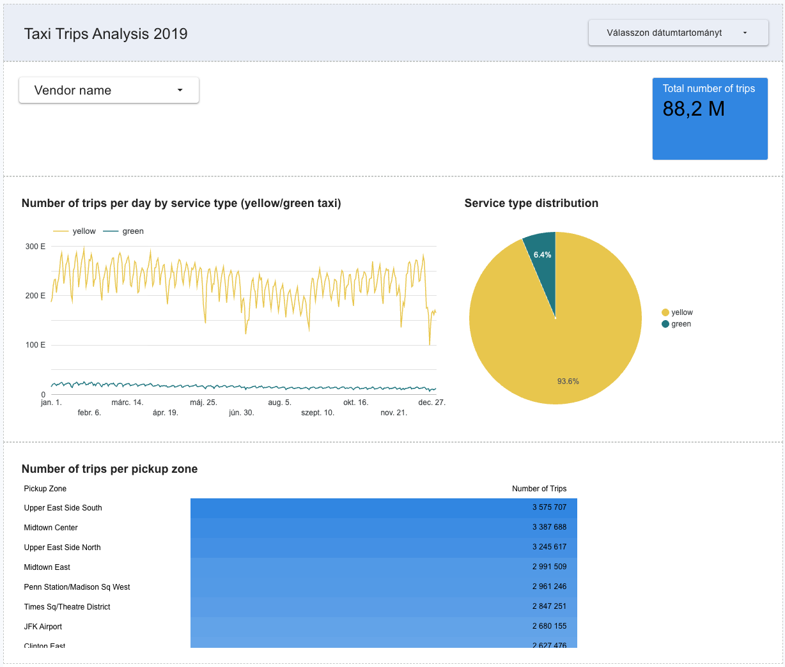

# NYC Taxi Analytics with dbt and BigQuery

This dbt project is the analytics transformation layer of my end-to-end NYC
Taxi data engineering project for the Data Engineering Zoomcamp. It transforms
raw 2019 Green and Yellow Taxi records in BigQuery into documented, tested,
business-ready fact, dimension, and reporting models.

The complete batch workflow currently covers infrastructure provisioning,
containerized ingestion, orchestration, cloud warehousing, analytics
engineering, and dashboarding:

```text
NYC Taxi CSV files
        ↓
Mage extraction and loading
        ↓
Google Cloud Storage
        ↓
BigQuery external and partitioned source tables
        ↓
dbt staging → intermediate → marts → reporting
        ↓
Looker Studio dashboard
```

## dbt lineage

The lineage graph shows the project from its two raw BigQuery sources through
staging and intermediate transformations to the dimensional and reporting
layers.



## What I built

### Source and staging layer

The project declares the partitioned Green and Yellow Taxi tables in BigQuery
as dbt sources. The staging models:

- standardize source column names;
- cast identifiers, timestamps, and numeric measures to consistent types;
- align the two taxi-service schemas;
- apply a deterministic date range when developing against the `dev` target.

Staging models are materialized as views so they remain lightweight interfaces
over the raw source tables.

### Intermediate layer

`int_trips_unioned` normalizes schema differences and combines Green and Yellow
Taxi records into one dataset with a `service_type` field.

`int_trips_cleaned` enriches the unioned data and creates a repeatable
surrogate `trip_id` with `dbt_utils.generate_surrogate_key`. Intermediate
models are materialized as tables because they perform reusable transformations
for several downstream models.

### Dimensional mart

The core mart follows a fact-and-dimension design:

| Model | Grain and purpose |
| --- | --- |
| `fact_trip` | One row per taxi trip, containing dimension keys, timestamps, trip attributes, financial measures, and derived trip duration |
| `dim_vendor` | One row per taxi technology provider |
| `dim_zone` | One row per NYC Taxi Zone, enriched with borough and service-zone attributes |
| `dim_payment_type` | One row per payment method |

The fact and reporting models use enforced dbt contracts to document expected
column names and data types.

### Reporting layer

`mart_trip_enriched` joins trip facts to vendor, payment, pickup-zone, and
drop-off-zone dimensions. It provides a denormalized model that reporting tools
can query without repeatedly rebuilding the dimensional joins.

`mart_monthly_zone_revenue` aggregates trips by pickup zone, month, and service
type. It includes:

- monthly fare, tip, tax, toll, surcharge, and total revenue;
- total monthly trip count;
- average passenger count;
- average trip distance.

Reporting models are materialized as views over the core mart tables.

## Seeds, macros, and reusable logic

The project includes two reference-data seeds:

- `taxi_zone_lookup.csv` for NYC Taxi Zone attributes;
- `payment_type_lookup.csv` for readable payment descriptions.

Custom macros keep repeated business logic in one place:

- `get_vendor_name` maps vendor codes to company names;
- `get_trip_duration_minutes` calculates duration from pickup and drop-off
  timestamps using dbt's cross-database `datediff` macro.

The project also uses:

- `dbt_utils` for surrogate keys and combination-of-columns tests;
- `dbt-codegen` to support development and documentation workflows.

## Data quality and documentation

Model and seed YAML files document model grain, columns, business meaning, and
expected data types. The test suite covers:

- `not_null` constraints on important identifiers, timestamps, and measures;
- uniqueness for dimension keys and seed identifiers;
- accepted values for service and payment types;
- relationships between facts and dimensions;
- uniqueness of the monthly zone, month, and service-type reporting grain.

Together, sources, `ref()` dependencies, documentation, tests, contracts, and
the generated lineage graph make transformations traceable from raw inputs to
reporting outputs.

## Looker Studio dashboard

I connected the reporting models to Looker Studio and built a small dashboard
with date and vendor filters. It presents:

- total trip volume;
- daily trip trends split by Green and Yellow Taxi service;
- service-type distribution;
- leading pickup zones by trip count.



The dashboard is intentionally compact, but it demonstrates the final
consumption layer: transformed warehouse models serving an interactive
business-facing report.

## Materialization strategy

| Layer | Materialization | Reason |
| --- | --- | --- |
| Staging | View | Lightweight source standardization |
| Intermediate | Table | Reusable schema alignment and enrichment |
| Core marts | Table | Stable fact and dimension models for analytics |
| Reporting | View | Flexible presentation models over the marts |

For local development, the project variables define a limited date range:

```yaml
vars:
  limit_dev_data: true
  dev_start_date: '2019-01-01'
  dev_end_date: '2019-02-01'
```

This keeps development iterations smaller while production targets can process
the complete source period.

## Project structure

```text
dbt_project/
├── models/
│   ├── sources/
│   ├── staging/
│   ├── intermediate/
│   └── marts/
│       └── reporting/
├── seeds/
├── macros/
├── assets/
├── dbt_project.yml
├── packages.yml
└── README.md
```

## Running the project

Prerequisites:

- access to a BigQuery project containing the Green and Yellow Taxi source
  tables declared under `models/sources/`;
- a dbt BigQuery profile or dbt Cloud connection;
- credentials supplied through the local dbt profile, dbt Cloud, or Google
  Application Default Credentials. Credentials are not stored in this
  repository.

Install packages and build the project:

```bash
dbt deps
dbt seed
dbt build
```

Generate and view dbt documentation:

```bash
dbt docs generate
dbt docs serve
```

## End-to-end repository context

The surrounding modules show how data reaches this transformation layer:

- [Terraform infrastructure](../terraform/README.md)
- [Mage orchestration and GCS ingestion](../workflow-orchestration-mage/README.md)
- [BigQuery warehousing, partitioning, and clustering](../data-warehousing-big-query/README.md)
- [Dockerized PostgreSQL ingestion foundations](../docker-postgres-pipeline/README.md)

This repository currently demonstrates a complete batch data path from source
to dashboard. Spark batch processing and Kafka streaming modules will extend
the project as the remaining Zoomcamp modules are completed.

## Key learnings

- Designing layered dbt projects with clear model responsibilities
- Using `source()` and `ref()` to create an explicit dependency graph
- Normalizing and unioning related datasets with different source schemas
- Building fact, dimension, and reporting models at documented grains
- Creating reusable Jinja macros and deterministic surrogate keys
- Managing reference data with dbt seeds
- Applying tests, model contracts, and documentation as part of transformation
  development
- Choosing materializations based on transformation reuse and reporting needs
- Connecting warehouse marts to a business intelligence dashboard
